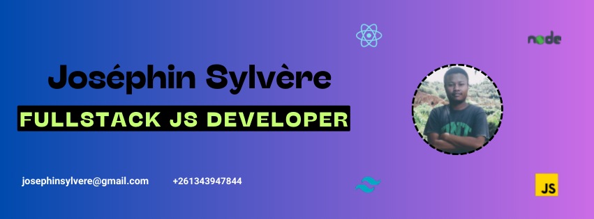

  

<h1 align="center">Hi 👋, I'm Sylvère</h1>
<h3 align="center">A passionate full stack developer from Madagascar 🇲🇬</h3>

  

  

- 🔭 I’m currently working on [MediMeet](https://github.com/ANDRIANALISOA-sylvere/MediMeet)

- 🌱 I’m currently learning **Nextjs**

- 👨‍💻 Some of my projects are available at [https://josephin-sylvere.vercel.app](https://josephin-sylvere.vercel.app)

- 💬 Ask me about **javascript, typescript, react, react native, nodejs, expressjs, nestjs, nextjs, laravel, php**

- 📫 How to reach me **josephinsylvere@gmail.com**

- 📄 Know about my experiences [https://josephin-sylvere.vercel.app/CV.pdf](https://josephin-sylvere.vercel.app/CV.pdf)

<h3 align="left">Connect with me:</h3>

<h3 align="left">Languages and Tools:</h3>

  

